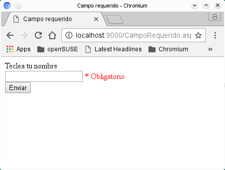

# Usando los controles de validación ASP .NET (RequiredFieldValidator)

<h3>Verificando la información de los formularios con los controles de validación</h3>
Algo indispensable en el desarrollo de formularios que trabajan con bases de datos, es la validación de los datos que solicitamos, acciones que son repetitivas e importantes ya que están relacionadas con la integridad y la seguridad de nuestra aplicación, una mala validación de los formularios puede convertirse en un problema que va desde un formato inadecuado o ataques con sentencias SQL (SQL Injection). .NET provee de controles web (Web Controls) de validación que nos ayudan a realizar este tipo de tareas, tareas como: verificar que los datos que necesitemos estén completos en el formulario, comparar que el tipo de datos que solicitemos coincida con el tipo de datos donde se va a almacenar en la base de datos, que los datos se encuentren en el formato que necesitamos, etc, estos controles no solo nos ahorran tiempo de codificación sino que también están diseñados para detectar la versión del navegador (browser) y así presentar el mejor HTML para ese navegador.

<h3>Validando los campos obligatorios con RequiredFieldValidator</h3>
Una de las primeras tareas que se necesitan cuando se desarrolla una aplicación es verificar que antes de que la información sea devuelta con los cambios hacie el servidor la información cumpla con los criterios obligatorios para continuar, incluso antes de la tarea de validar el formato de los campos, debemos asegurarnos que eses campos tienen información y los campos necesarios no estan sin información, el control RequiredFieldValidator nos ayuda a esa tarea, el código del ejemplo puede descargarse aqui mismo.
Lo compilamos:
csc /t:library CampoRequerido.aspx.cs

Lo instalamos: copiamos el ensamblado a la carpeta bin
ejecutamos <i>xsp</i> y abrimos el navegador con la dirección <i>http://localhost:8080/CampoRequerido.aspx</i>

Al presionar el botón para enviar los datos al servidor se verifica que el atributo de la página Page.IsValid regrese un valor verdadero, si es falso desplegará el mensaje de error de lo contrario desplegará el texto en el control etiqueta Label. En la siguiente imagen se muestra la ejecucción del programa.

<h3>Propiedades del control RequiredFieldValidator</h3>

<strong>controlToValidate:</strong> El control de donde obtendremos el valor para evaluar
  

  

<strong>errorMessage:</strong> El texto del mensaje que se desplegara si no se cumplen las condiciones
  

<strong>display:</strong> Esta propiedad puede tener 3 valores: 
  <ol>
    <li>Static:</li> es la propiedad predeterminada, reserva un espacio suficiente en la página para mostrar el mensaje de error.
    <li>Dynamic:</li> el espacio para mostrar el mensaje no se reserva, cuando el mensaje se despliega se desplaza el contenido existente en la página. 
    <li>None:</li> el mensaje no será desplegado en el lugar del control sino en el control ValidationSummary si se localiza en la misma página.
  </ol>
  

